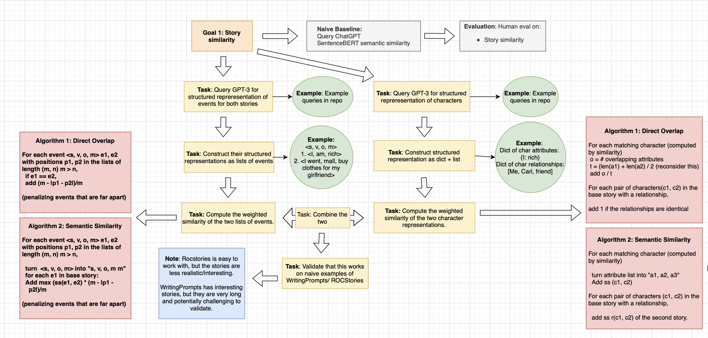

# GPT-4 Enhanced Story Regeneration

Imagine the fascinating possibilities that unfold when we turn Happy Gilmore into a spine-chilling horror script. Picture a gripping narrative that takes Adam Sandler on a harrowing journey through the golf course, facing ominous forces that lurk in the trees.

Moreover, consider the potential of rewriting your email to exude more assertiveness or confidence. Sometimes, the mere sound of our sentences can leave us dissatisfied. 

Text regeneration comes to the rescue, offering a variety of fresh alternatives that breathe new life into text. Text regeneration is a useful application in all aspects of life - and a domain rife with possibility due to the growing impact of generative AI.

The challenge with text regeneration is that it can be challenging to maintain both stylistic and semantic coherence - asking for a scary Happy Gilmore can turn Shooter Mcgavin into Slenderman when all I really want is a scarier Shooter Mcgavin. Thus, we create a controllable story generation framework where a user can control just how semantically similar the regenerated text must be. This can be split into two parts: Text/Story Similarity and Story Regeneration

## Story Similarity

It is very challenging to use a rules-based or a syntactic method of measuring the semantic similarity of two stories. The syntactic structure can be wildly creative, the vocabulary is enormous, and there is simply too much variance. However, we can leverage GPT-4 to simplify the process using one of two methods.

1. (Baseline) Just ask GPT-4 for the similarity between two texts.
2. Ask GPT-4 for all characters, character attributes, and events in a text, then manually compare these features across texts.

This method is far more accurate, and is also very robust to changes in domain (email, story, article), style, or any other aspect. However, it is also much more computationally expensive, and there will always be some variability in the result.

Method 2 mitigates this variability, and also provides explainability and controllability to the results 

## Story Regeneration

Story Regeneration is very simple given a reliable story-similarity metric. Nothing (open-source) can currently compete with the neural backbone of GPT-4, and text generation is thus reliant on single-model output with some prompt engineering. These are the two methods that I considered.

1. (Baseline) Simple regeneration prompt + reranking
2. Prompt engineering asking for specific characters, character attributes, or events + reranking.

The second method is more effective + adds controllability to the process. These methods were tested on parts of the ROC_Stories dataset and the Reddit r/writing_prompts dataset.

The main methods can be run from the src/main.py files.
